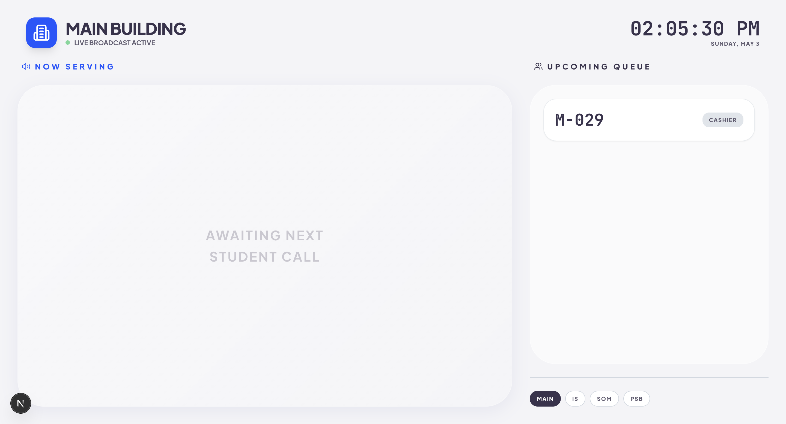

# 🎟️ UniQueue

UniQueue is a centralized queueing system for university enrollment designed for the Main Building, IS, SOM, and PSB. It replaces physical ticket printers with QR-based digital tickets and gives students, staff, and monitors a shared real-time view of the queue.

Live system: https://uni-queue-student-kiosk-terminal.vercel.app/



## Overview

This project is built as a zero-hardware queueing workflow:

- Students request tickets from the kiosk interface.
- A QR code links each ticket to a live status page on mobile.
- Staff terminals call the next student, mark completion, or mark no-shows.
- Public monitors display the active queue and speak announcements aloud.
- Admin screens provide analytics and assignment controls.

The UI follows a custom Liquidglass design language with glassmorphism surfaces, strong contrast, responsive layouts, and motion-enhanced interactions.

## Tech Stack

- Frontend: Next.js 15 App Router, React 19, Tailwind CSS, Framer Motion
- Auth and realtime data: Firebase Auth + Firestore listeners
- AI/voice support: Genkit + Google GenAI TTS flow
- UI helpers: Radix UI, Lucide React, qrcode.react, Recharts, react-hook-form, zod
- Typography: Plus Jakarta Sans and JetBrains Mono via Google Fonts

## Application Surfaces

- `/` - home launcher for student and management entry points
- `/kiosk` - ticket generation flow with department and service selection
- `/monitor` - live public monitor with Now Serving, upcoming queue, and audio announcements
- `/staff` - staff terminal for calling the next ticket and updating ticket status
- `/admin` - admin analytics dashboard
- `/admin/assignments` - staff assignment management for departments and offices
- `/status/[deptId]/[ticketId]` - ticket status page reached from QR or direct link
- `/track/[id]` - redirect route that sends users to the ticket status page

## Repository Structure

```text
src/
	app/
		page.tsx
		kiosk/page.tsx
		monitor/page.tsx
		staff/page.tsx
		admin/page.tsx
		admin/assignments/page.tsx
		status/[deptId]/[ticketId]/page.tsx
		track/[id]/page.tsx
	ai/
		dev.ts
		genkit.ts
		flows/public-monitor-tts-announcements.ts
	components/
		ui/
		FirebaseErrorListener.tsx
	context/
		QueueContext.tsx
	firebase/
		client-provider.tsx
		config.ts
		provider.tsx
		firestore/
	hooks/
	lib/
docs/
	blueprint.md
	backend.json
	preview.png
```

## Features

- QR-based digital ticket creation from the kiosk
- Department-aware service routing for Main Building, IS, SOM, and PSB
- Live ticket status pages for students
- Staff terminal controls for calling, completing, and marking no-shows
- Public monitor with large-format queue display and voice announcements
- Admin analytics with traffic summaries and building breakdowns
- Responsive Liquidglass UI across mobile, tablet, kiosk, and monitor layouts

## Local Setup

### Prerequisites

- Node.js 20 or newer
- npm
- Access to the Firebase project configured in `src/firebase/config.ts`

### Install dependencies

```bash
npm install
```

### Run the app locally

```bash
npm run dev
```

The development server runs on port `9002`.

### Optional checks

```bash
npm run typecheck
npm run lint
```

### Optional AI dev server

```bash
npm run genkit:dev
```

Use `npm run genkit:watch` if you want the Genkit entrypoint to reload while you edit `src/ai/dev.ts`.

## Environment Notes

This snapshot uses Firebase services directly from `src/firebase/config.ts` and the Firebase provider layer in `src/firebase/`.

If your team moves those values to environment variables later, document them in a `.env.local` file and update this README accordingly.

## Available Scripts

```bash
npm run dev
npm run build
npm run start
npm run lint
npm run typecheck
npm run genkit:dev
npm run genkit:watch
```

## Architecture Notes

- `src/context/QueueContext.tsx` is the main queue state layer.
- Firestore snapshots keep the kiosk, monitor, staff, and admin views in sync.
- `src/ai/flows/public-monitor-tts-announcements.ts` contains the voice announcement flow.
- `src/lib/types.ts` defines the shared queue, department, counter, and ticket models.
- `src/app/layout.tsx` loads the global fonts and wraps the app in Firebase providers.

## Design System

Liquidglass in this repository is centered on:

- soft white and frosted surfaces
- bold blue primary actions
- high-contrast typography for public displays
- compact mobile-first spacing for kiosk and status views
- animated transitions for queue changes and confirmations

## Working on the Project

- Keep changes focused to one route or one system area when possible.
- Use the branch and commit standards in `CONTRIBUTING.md`.
- Include screenshots for UI changes, especially for the mobile status view and the TV monitor view.

## Preview

The current visual reference is in `docs/preview.png`.

## License

No license file is currently included in this snapshot. Add one before public distribution if needed.
